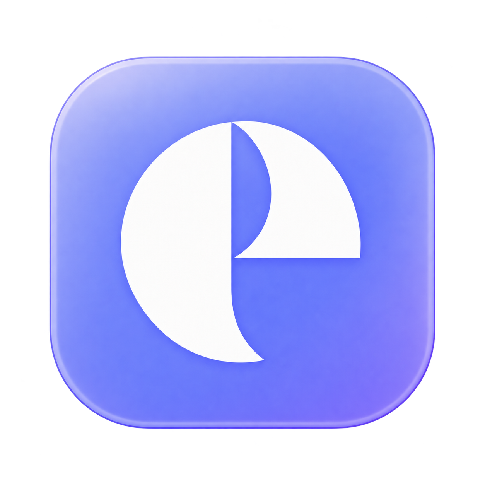

<div align="center">
  
  <h1>EitnyGameHub</h1>
  <p><b>English</b> · <a href="README.ru.md">Русский</a></p>
  <p><b>Your games. Your Mac.</b></p>
  <p>A native macOS launcher for your Steam library and Windows games on Apple Silicon.</p>
  <p><b>0.4.1 · Latest · macOS · SwiftUI</b></p>
  <p>
    <a href="https://github.com/joineitny/EitnyGameHub/releases/latest">Download installer</a> ·
    <a href="#installation">Installation</a> ·
    <a href="#compatibility">Compatibility</a> ·
    <a href="https://github.com/joineitny/EitnyGameHub/issues/new/choose">Report a result</a>
  </p>
</div>

---

**EitnyGameHub** brings your Steam library, player profile and game environment setup into one native macOS application. It takes an open-source approach to the problem addressed by tools such as CrossOver: running Windows games on a Mac through a compatibility layer.

The interface is built with SwiftUI. Wine runs Windows applications, while DXMT and D3DMetal translate graphics to Metal. EitnyGameHub configures these components for individual games and makes them accessible through a macOS interface.

This is an independent project in early development. **The tested scenarios in this release are GWENT and the first Path of Exile in windowed mode.** A game appearing in the library does not mean its compatibility has been confirmed. We have not conducted comparative performance benchmarks against CrossOver.

## Help test Windows games on Mac

**We are looking for community testers across Apple Silicon Macs. You do not need to be a developer.** Install the current release, try a game and tell us what happened. Successful launches and playable sessions are just as valuable as bug reports.

We particularly welcome GWENT and Path of Exile 1 reports from other Mac chips and macOS versions, fresh installations, mouse and trackpad checks, relaunches after a restart, and actual gameplay sessions.

**[Submit a compatibility report](https://github.com/joineitny/EitnyGameHub/issues/new?template=compatibility.yml)** · **[Report an app bug](https://github.com/joineitny/EitnyGameHub/issues/new?template=bug_report.yml)** · **[Contributing guide](CONTRIBUTING.md#english)**

Include your Mac model, chip and memory, macOS and EitnyGameHub versions, game, launch method, graphics settings and outcome. If you report FPS, include the resolution, upscaler and scene: menu, town or combat. Use a normal window for PoE. Reports in **English or Russian** are welcome.

## Features

- **Steam library:** cover art, search, sorting, installed games and playtime.
- **Player profile:** Steam name and avatar without a separate API key.
- **Environment setup:** download required components with checksum verification.
- **Game profiles:** separate launch and graphics settings for GWENT and Path of Exile.
- **Native interface:** SwiftUI, dark styling, sidebar navigation and a macOS Dock icon.
- **macOS installer:** install into Applications through the standard installer wizard.
- **Open source:** application code, checks and installer tooling are included in the repository.

## Compatibility

| Game | Graphics | Status in 0.4.1 |
| :--- | :--- | :--- |
| **GWENT: The Witcher Card Game** | DirectX 11 → DXMT → Metal | Sign-in and gameplay confirmed by the project creator; automatic windowed mode with working mouse and trackpad input |
| **Path of Exile — the first game** | DirectX 12 → D3DMetal → Metal | Experimental support; windowed gameplay confirmed, FSR available |
| Other Steam games | Depends on the game | Listed in the library; compatibility has not been tested |

Testing has been performed on a **MacBook Pro M3 Pro / macOS 27**. Other Mac models and macOS versions still need testing. Compatibility does not imply guaranteed frame rates, anti-cheat support or identical behavior in every game mode.

**PoE fullscreen is currently unstable:** switching to Fullscreen inside the game caused a black screen. Use a normal window. Launching PoE restores windowed mode while preserving your chosen resolution, FSR and frame cap.

## Requirements

| Component | Requirement |
| :--- | :--- |
| Mac | Apple Silicon: M1 or later; arm64 build |
| macOS | 14 or later; Path of Exile / D3DMetal requires 15 or later |
| Rosetta 2 | Required for the Windows environment; installed separately through macOS |
| Internet | Required for component setup, Steam sign-in and game downloads |
| Account | Your own Steam account; GWENT also requires GOG sign-in inside the game |
| Storage | Enough space for the environment, Steam and your selected games |

Intel Macs are not supported by this release. The installer contains the launcher only; compatibility components, Steam and games are downloaded separately.

## Installation

The app and installer currently use **Russian interface text**. The instructions below include the actual button labels alongside English explanations. This English README does not change the application's interface language.

1. Open the [0.4.1 release](https://github.com/joineitny/EitnyGameHub/releases/tag/v0.4.1) and download **EitnyGameHub-0.4.1-Installer.pkg**.
2. Run the installer. EitnyGameHub will be installed into **Applications**.
3. Open EitnyGameHub and click **«Подготовить Steam»** (Set up Steam). Wait for the components to download.
4. Click **«Открыть Steam»** (Open Steam), sign in to your own account and open your library.
5. Install the game through Steam, then refresh the library in EitnyGameHub.

### Launching GWENT

Install GWENT in the prepared Windows Steam client, then click its card in EitnyGameHub. The launcher skips the incompatible REDlauncher and enables windowed mode. Sign in to your own GOG account inside the game when prompted.

### Launching Path of Exile

Open **Path of Exile → «Подготовить PoE»** (Set up PoE). This creates a separate environment with its own Steam client. Sign in, install **the first Path of Exile**, then use **«Играть в PoE»** (Play PoE).

Three initial graphics presets are available. Applying a preset requires the game to be closed and backs up the configuration; audio settings and key bindings are preserved. A normal launch does not replace your chosen resolution or FSR settings. GWENT keeps its separate environment.

### If macOS blocks opening

The application has a local ad-hoc signature. **The installer is not Developer ID signed, and this release is not notarized by Apple.** After attempting to open it, check **System Settings → Privacy & Security → Open Anyway** for the EitnyGameHub file you downloaded. See [Apple's instructions](https://support.apple.com/102445). There is no need to disable macOS security globally.

For a different error, include the exact message in an Issue. Using the installer does not resolve every possible compatibility problem.

## Library and data

The library uses **local Steam data**, rather than a continuous query of cloud licenses. After purchases, account changes or game installations, open the Steam library and refresh EitnyGameHub. Cached information may be incomplete or outdated for some accounts; Steam remains the authority on available games.

Sign-in happens in the official Steam client. EitnyGameHub does not request your Steam password in its own interface. Cover art comes from Steam's cache or CDN, and avatars come from public Steam profiles.

On a new Mac, game environments are stored by default in:

```text
~/Library/Application Support/EitnyGameHub
```

Updating the application does not delete this directory. **Do not share it with other users:** the Steam environment can contain sign-in data. To share the launcher, send the installer from Releases.

Portable storage is supported through an `EitnyGameHub Data` folder beside the app containing an empty `.portable` file. Older `GwentBridge Data` directories and previous settings are also recognized. Developers can select an absolute path using `EITNY_GAMEHUB_DATA`.

## Troubleshooting

| Situation | What to try |
| :--- | :--- |
| Empty or outdated library | Open the Steam library, then refresh EitnyGameHub |
| Data inaccessible after updating | **«Настройки → Разрешить доступ к папке»** (Settings → Allow folder access); select the app's data folder |
| PoE hangs after changing display mode | Use ⌘Tab to switch to EitnyGameHub → Path of Exile → **«Восстановить оконный режим…»** (Restore windowed mode); this closes the current PoE session |
| Missing compatibility component | Check Rosetta 2 and internet access, then retry setup |
| Other problem | [Report an app bug](https://github.com/joineitny/EitnyGameHub/issues/new?template=bug_report.yml) with your Mac, macOS, game, steps and exact error |

Before posting logs, remove personal paths, account names, tokens and other private information. Do not upload a complete Steam data folder.

## Building from source

You need an Apple Silicon Mac and Apple's Command Line Tools. The verified build environment uses Swift 6.4, Swift 5 language mode and a macOS 14 deployment target.

```sh
git clone https://github.com/joineitny/EitnyGameHub.git
cd EitnyGameHub
bash build.sh
bash test.sh
```

The app is created beside the source directory at `../EitnyGameHub.app`. Tests use temporary fixtures and cover launch boundaries, Steam parsers, environment isolation and preservation of game settings.

To package the built application:

```sh
bash package.sh
```

The installer is created in `../Installer-0.4.1/`. Packaging verifies the file list, extracted application contents, signature, architecture and executable permissions. Developer ID signing and Apple notarization are not yet part of this process.

### Project structure

```text
Sources/       SwiftUI app, Steam library and game settings
Resources/     Steam launch scripts, game profiles and icons
Tests/         Parser and settings checks
Installer/     PKG build and verification tooling
build.sh       Build the application
test.sh        Run checks without launching real games
package.sh     Create the installer
```

## Development directions

- Test more Apple Silicon models and macOS versions.
- Improve first-time setup and diagnostics.
- Expand the list of verified game profiles.
- Investigate PoE fullscreen behavior.
- Add Developer ID signing and Apple notarization.

These are areas for development, not promises of delivery dates or future compatibility. [Testing reports](https://github.com/joineitny/EitnyGameHub/issues/new?template=compatibility.yml), fixes, translations and documentation improvements are welcome. Start with the [contributing guide](CONTRIBUTING.md#english). Changes should preserve profile isolation and the verified GWENT launch behavior.

## Who creates EitnyGameHub

**EitnyGameHub is created by [joineitny](https://github.com/joineitny) in collaboration with OpenAI Codex.**

- **joineitny:** project idea, product and game selection, interface decisions, testing on a real Mac and feedback.
- **OpenAI Codex:** assistance with implementation, game environment configuration, diagnostics, automated checks, builds and documentation.

The project grew through this collaboration, from the idea of playing favorite games on a Mac to a working open-source application.

## Components and licenses

The project code is distributed under the [MIT License](LICENSE). Third-party components, games and trademarks have their own terms:

- [Wine Sikarugir 10.0_6](https://github.com/Sikarugir-App/Engines/releases/tag/v1.0): Windows compatibility layer; Wine LGPL-2.1.
- [Sikarugir Template 1.0.11](https://github.com/Sikarugir-App/Template/releases/tag/v1.0): environment dependencies.
- [DXMT 0.80](https://github.com/3Shain/dxmt/releases/tag/v0.80): DirectX 11 → Metal for GWENT; MIT.
- [D3DMetal 3.0](https://github.com/Sikarugir-App/Sikarugir/tree/main/D3DMetal/3.0): DirectX 12 → Metal for PoE; Apple Game Porting Toolkit terms.
- [Steam](https://store.steampowered.com/about/): Valve's game client and library.
- [SteamAppInfo](https://github.com/ValveResourceFormat/SteamAppInfo): reference information about Steam's cache format.

Third-party runtimes and games are not bundled with the installer. Runtime archives are downloaded from pinned sources and verified using SHA-256; their licenses and notices are retained. EitnyGameHub's open-source license does not replace third-party terms.

EitnyGameHub is an independent project, not affiliated with Apple, Valve, CD PROJEKT RED, Grinding Gear Games or CodeWeavers. CrossOver is mentioned only to explain the category of software.
